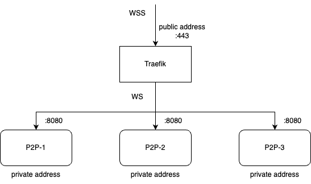

# `minows`
This package implements `Mino` interface using `go-libp2p`. More info is to be added as development progresses.

## Architecture 
`minows` provides a minimalistic network overlay using WebSocket (Secure) connections. It assumes the following network environment, as illustrated by the diagram:

- nodes are running in local networks with local addresses (e.g. 172.24.0.6)
- nodes listen on port 8080 for HTTP connections (:8080)
- Traefik is configured on each node to listen on port 443 for HTTPS connections to the public hostname (e.g. p2p-1.dela-1.c4dt.org:443)
- Traefik accepts incoming HTTPS connections from client nodes by establishing corresponding HTTP connections to the server node 
- the same connections then upgrade to WebSocket Secure (WSS) between client node and Traefik, and WebSocket (WS) between Traefik and server node

## Connection Types 
`minows` supports 2 types of connections between nodes:
- WebSocket (WS): plaintext exchange without encryption, primarily used for local testing and development 
- WebSocket Secure (WSS): encrypted WebSocket connections, used in production environments 